<div align="center">

# Gage Chisholm


<br>

[](https://www.linkedin.com/in/gage-c-393b6333b/)
[](mailto:gage.chisholm.w@gmail.com)
[](https://github.com/gagechisholm)

</div>

<br>

```text
> whoami

role       U.S. Marine Corps Sergeant
work       communications systems and network operations
focus      blue team security, detection engineering, network security
building   detections, automation, production software
studying   CCNA | Network+ | Security+
```

I work in military communications and network operations and am transitioning into cybersecurity.

Most of what interests me lives somewhere between networking, security telemetry, automation, and figuring out why something behaves the way it does.

I also build software, usually because I find a problem and decide it would be easier to build the solution myself.

<br>

## Security and Open Source

### SigmaHQ

[](https://github.com/SigmaHQ/sigma)
[](https://github.com/SigmaHQ/sigma/pull/6285)

**DbgSrv.exe Child Process Detection**

I researched potential proxy execution through Microsoft's signed `DbgSrv.exe` debugging utility and built a Sigma process creation rule to detect child processes spawned through it.

The behavior was reproduced locally rather than written from theory alone.

```text
Windows process execution
        │
        ▼
     DbgSrv.exe
        │
        │  -c <process>
        ▼
   Child Process
        │
        ▼
 Sysmon Event ID 1
        │
        ▼
   Sigma Detection
```

The work included:

* Local positive testing
* Control testing without child-process execution
* Sysmon telemetry collection
* Parent and child process analysis
* Sigma CLI validation
* SigmaHQ repository test suites
* LOLBin research and detection logic development

**[View SigmaHQ PR #6285](https://github.com/SigmaHQ/sigma/pull/6285)**

<br>

## What I've Built

<table>
<tr>
<td width="50%" valign="top">

### ChairPal

**Production booking platform**

A full booking and payments platform built for independent service providers.

Customers can view availability, book appointments, make deposits, receive reminders, and confirm appointments while providers manage scheduling, services, payments, analytics, and account settings.

**Some of what is under the hood**

`Next.js` `TypeScript` `React`

`Supabase` `PostgreSQL` `RLS`

`Stripe` `Stripe Connect`

`SMS` `Email` `Webhooks`

`Playwright` `Sentry` `Vercel`

Includes authentication, role-based access, rate limiting, spam protection, booking deduplication, automated reminders, billing, seller payouts, analytics, API testing, accessibility testing, smoke testing, and load testing.

<sub>Private source</sub>

</td>
<td width="50%" valign="top">

### RaidLadder

**World of Warcraft raid analytics bot**

Discord application that turns Warcraft Logs data into automated guild performance reports.

Supports Retail and Classic Warcraft, automated raid detection, role-specific scoring, progression analysis, leaderboards, player history, raid groups, configurable scoring models, and generated recap cards.

**Some of what is under the hood**

`Python` `discord.py` `Flask`

`Warcraft Logs API` `Raider.IO`

`Stripe` `REST APIs`

`LLM APIs` `Pillow`

`Staging + Production Environments`

Includes usage telemetry, monetization, automated reporting, AI-generated player callouts, production safeguards, server lifecycle management, and a versioned release process.

<sub>Private source</sub>

</td>
</tr>
</table>

<br>

### Chisels & Bits Shader Compatibility Patch

[](https://github.com/gagechisholm/chisels-bits-shader-compat)

Tracked down a rendering crash involving Chisels & Bits, Scena, Iris, and Sodium on Minecraft 1.21.1.

The issue came from Scena using an outdated Iris rendering path. The patch replaces the incompatible handler with the current `VertexEncoderInterface` path while leaving unknown implementations untouched.

`Java 21` `NeoForge` `Gradle` `Mixin` `Iris` `Sodium`

This one was less about Minecraft and more about digging through third-party code until I understood exactly where the incompatibility occurred.

<br>

## Tools I Actually Use

<div align="center">


</div>

<br>

<div align="center">


</div>

<br>

## Current Path

<div align="center">


</div>

<br>

My current focus is building enough depth in networking and defensive security that I can understand the underlying behavior first and the security tooling second.

The roadmap continues into CySA+, BTL1, and Microsoft SC-200.

<br>

## GitHub Activity

<div align="center">




</div>

<br>

## Contributions

<picture>
  <source media="(prefers-color-scheme: dark)" srcset="https://raw.githubusercontent.com/gagechisholm/gagechisholm/output/pacman-contribution-graph-dark.svg">
  <source media="(prefers-color-scheme: light)" srcset="https://raw.githubusercontent.com/gagechisholm/gagechisholm/output/pacman-contribution-graph.svg">
  
</picture>

<br>

<div align="center">

**Networks tell you where the traffic went. Logs tell you what happened. Code lets you do something about it.**

</div>
